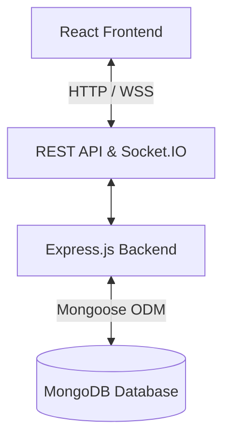

<div align="center">


# TaskFlow
**Project Management System**

*Manage Projects. Empower Teams. Track Performance.*

[](https://opensource.org/licenses/MIT)
[](https://nodejs.org/)
[](https://reactjs.org/)
[](https://www.mongodb.com/)
[](https://expressjs.com/)
[](https://tailwindcss.com/)

[Live Demo](https://taskflow-demo-link-placeholder.vercel.app) • [GitHub Repository](https://github.com/abdellaharegaw616-web/2026-internship-project)

</div>

---

## 📖 Overview

TaskFlow is a modern web-based Project Management System designed to help teams organize projects, manage tasks, collaborate with team members, monitor progress, and improve productivity from one centralized platform. 

**The Problem It Solves:** Modern teams often suffer from fragmented workflows, relying on disconnected tools for task tracking, team communication, and performance monitoring. This leads to information silos and decreased efficiency.

**Who Can Use It:** Software development teams, marketing agencies, HR departments, and any fast-growing organization looking to streamline their daily operations.

**Why Centralized Project Management:** Centralizing data ensures a single source of truth. It provides total accountability, clear task ownership, and frictionless collaboration, allowing teams to focus on shipping their best work rather than chasing status updates.

---

## ✨ Key Features

- **User Registration and Login:** Secure multi-step onboarding with JWT-based sessions.
- **JWT Authentication:** Stateful and secure API communication.
- **Role-Based Access Control (RBAC):** Granular permissions for different organizational tiers.
- **Dashboard:** Real-time analytics, progress visualization, and workload indicators.
- **Project Management:** Track progress automatically, manage budgets, and define milestones.
- **Task Management:** 4-stage workflows, dependencies, and file attachments.
- **Team Management:** Organize by departments and track individual performance metrics.
- **Project Progress Tracking:** Visual percentage completion based on real-time task data.
- **Task Priorities and Statuses:** Flexible priority tiering and status workflows.
- **Calendar:** Track task deadlines and project milestones.
- **Time Tracking:** Monitor estimated vs. actual time spent on tasks.
- **Responsive Design:** Fully optimized for mobile, tablet, and desktop viewports.
- **Dark/Light Mode:** Intelligent, context-aware theme preferences.
- **Real-Time Communication:** Live updates powered by Socket.IO.
- **[Planned] Messages:** Built-in team direct messaging.
- **[Planned] Meetings:** Integrated scheduling and video call management.
- **[Planned] Documents:** Centralized wiki and document collaboration.
- **[Planned] Goals:** OKR and KPI tracking for the organization.
- **[Planned] Reports:** Advanced exportable PDF/Excel custom reports.
- **[Planned] Finance:** In-depth cost analysis and billing integration.
- **[Planned] Automations:** Custom trigger-action workflows.
- **[Planned] Portfolio:** Cross-project high-level management.
- **[Planned] Resource Planning:** Capacity planning and workload forecasting.
- **[Planned] Settings:** Organization-wide custom configurations.

---

## 👥 User Roles

TaskFlow utilizes a comprehensive RBAC (Role-Based Access Control) architecture to ensure security and logical data separation.

- **Super Admin**: Manages system-level configuration, global settings, and acts as the ultimate authority over all organizational data.
- **Admin**: Manages user accounts, department organization, system preferences, and has read/write access across all projects.
- **Project Manager**: Creates projects, allocates budgets, assigns team members to projects, and oversees task completion.
- **Team Member**: Views assigned projects, manages their own task statuses, tracks time, and collaborates via comments.

---

## 💻 Technology Stack

| Technology | Role | Description |
| :--- | :--- | :--- |
| **React** | Frontend Library | Component-based UI rendering (v18) |
| **Vite** | Build Tool | Extremely fast HMR and optimized frontend bundling |
| **Tailwind CSS** | Styling | Utility-first CSS framework for rapid, responsive design |
| **Framer Motion** | Animation | Smooth, physics-based UI transitions and micro-animations |
| **Lucide React** | Icons | Clean, consistent SVG icon set |
| **React Router** | Routing | Client-side routing for seamless page navigation |
| **Node.js** | Runtime Environment| Server-side JavaScript runtime for the backend |
| **Express.js** | Backend Framework | Minimalist web framework for robust REST APIs |
| **MongoDB** | Database | NoSQL document database for flexible data modeling |
| **Mongoose** | ODM | Elegant object modeling and schema validation |
| **JWT** | Authentication | JSON Web Tokens for stateless, secure session management |
| **bcrypt** | Security | Password hashing and salting |
| **Socket.IO** | Real-time | Bidirectional event-based communication for live updates |
| **Axios** | HTTP Client | Promise-based data fetching and interceptors |
| **Vercel** | Hosting | Production frontend deployment |
| **Render** | Hosting | Production backend deployment |
| **MongoDB Atlas** | Database Host | Fully managed cloud database service |

---

## 🏗️ System Architecture

TaskFlow follows a decoupled client-server architecture utilizing RESTful APIs and WebSocket connections for real-time interactivity.



- **React Frontend**: Handles the view layer, client-side routing, state management, and user interactions.
- **REST API / Socket.IO**: Acts as the communication bridge. REST handles standard CRUD operations while Socket.IO pushes real-time events.
- **Express.js Backend**: Contains the business logic, route controllers, authentication middleware, and database transaction handling.
- **MongoDB Database**: Persists application data (Users, Projects, Tasks) in flexible BSON documents.

---

## 📁 Project Structure

```text
taskflow/
├── client/
│   ├── src/
│   │   ├── api/            # Axios instances and API call definitions
│   │   ├── assets/         # Static images, icons, and fonts
│   │   ├── components/     # Reusable UI components (Buttons, Modals, Cards)
│   │   ├── context/        # React Context providers (Auth, Theme)
│   │   ├── hooks/          # Custom React hooks
│   │   ├── pages/          # Full page layouts (Dashboard, Projects, Login)
│   │   ├── routes/         # Protected and public route configurations
│   │   ├── utils/          # Helper functions and formatters
│   │   ├── App.jsx         # Root component
│   │   └── main.jsx        # Entry point
│   ├── package.json
│   └── vite.config.js
│
├── server/
│   ├── src/
│   │   ├── config/         # Database and environment configurations
│   │   ├── controllers/    # Route logic and request handling
│   │   ├── middlewares/    # Custom middlewares (Auth, Error Handling, Validation)
│   │   ├── models/         # Mongoose schemas (User, Project, Task)
│   │   ├── routes/         # Express route definitions
│   │   ├── services/       # Complex business logic
│   │   ├── utils/          # Utility classes (Logger, Emailer)
│   │   └── server.js       # Application entry point
│   ├── package.json
│   └── .env.example
│
└── README.md
```

---

## 🚀 Installation

Follow these instructions to set up TaskFlow on Windows, Linux, or macOS.

1. **Clone the repository**
   ```bash
   git clone https://github.com/abdellaharegaw616-web/2026-internship-project.git
   cd 2026-internship-project
   ```

2. **Install frontend dependencies**
   ```bash
   cd client
   npm install
   cd ..
   ```

3. **Install backend dependencies**
   ```bash
   cd server
   npm install
   ```

---

## 🔐 Environment Variables

You need to configure your environment variables before running the application.

1. Create a `.env` file in the `server` directory:
   ```env
   MONGODB_URI=mongodb://localhost:27017/taskflow
   JWT_SECRET=your_super_secret_jwt_key
   JWT_EXPIRE=7d
   PORT=5000
   CLIENT_URL=http://localhost:5173
   NODE_ENV=development
   ```

2. Create a `.env` file in the `client` directory:
   ```env
   VITE_API_URL=http://localhost:5000
   ```

> **Warning:** Never commit real secrets, API keys, or production database URIs to version control.

---

## 🏃 Running the Application

To run the application locally, start both the backend and frontend servers in separate terminal windows.

**Backend:**
```bash
cd server
npm run dev
```
*The backend API will run on `http://localhost:5000`*

**Frontend:**
```bash
cd client
npm run dev
```
*The frontend application will run on `http://localhost:5173`*

---

## 🌐 API Overview

The backend exposes several RESTful endpoints grouped by domain:

- `/api/auth`: Handles user registration, login, profile management, and password resets.
- `/api/users`: Admin-only routes for managing organizational users, roles, and fetching performance metrics.
- `/api/projects`: Endpoints for CRUD operations on projects, archiving, cloning, and milestone tracking.
- `/api/tasks`: Manages task creation, assignments, status updates, time tracking, and comments.
- `/api/dashboard`: Aggregates statistics, team utilization data, and public stats.
- **[Planned]** `/api/teams`: Department grouping and cross-functional team management.
- **[Planned]** `/api/messages`: Direct messaging and team chat capabilities.
- **[Planned]** `/api/meetings`: Meeting scheduling and integrations.
- **[Planned]** `/api/documents`: Centralized file and wiki storage.

---

## 🛡️ Authentication & Security

TaskFlow implements robust, industry-standard security practices:

- **JWT Authentication:** Stateless, signed JSON Web Tokens for session handling.
- **Password Hashing:** Passwords are mathematically hashed using `bcrypt` before database storage.
- **Protected Routes:** Both client-side React routes and server-side Express endpoints require authenticated access.
- **Role-Based Authorization:** Middleware explicitly checks user roles (e.g., Admin-only routes).
- **Environment Variables:** Sensitive keys and URIs are isolated from the codebase.
- **Input Sanitization:** Integration of `express-mongo-sanitize` and `xss-clean` to prevent NoSQL injection and Cross-Site Scripting.
- **HTTP Security Middleware:** `helmet` is utilized to secure HTTP headers.
- **Rate Limiting:** `express-rate-limit` prevents brute-force attacks against the API.
- **CORS Configuration:** Strictly configured Cross-Origin Resource Sharing.

---

## 🗄️ Database Design

The system uses MongoDB with Mongoose ODM. Major collections include:

- **User**: Stores authentication credentials, roles, profile data, and theme preferences.
- **Project**: Maintains project details, timelines, allocated budgets, associated team members, and milestones.
- **Task**: Tracks individual work items, status (Todo, In Progress, Review, Done), priorities, assignees, and comments.
- **[Planned] Team**: Will represent departments and distinct organizational units.
- **[Planned] Message**: Will store real-time chat histories and direct messages.
- **[Planned] Meeting**: Will store calendar events and meeting metadata.
- **[Planned] Document**: Will handle rich text documents and file metadata.

---

## 🎨 UI/UX

TaskFlow's design philosophy centers on reducing cognitive load and maximizing usability:

- **Clean SaaS Interface**: Minimalist aesthetics with ample whitespace.
- **Responsive Layout**: Fluid grids ensuring a native feel across Desktop, Tablet, and Mobile.
- **Consistent Spacing**: Standardized padding and margin utility scales.
- **Accessible Interface**: High-contrast text, clear focus states, and semantic HTML.
- **Clear Navigation**: Intuitive sidebar routing and breadcrumb trails.
- **Professional Dashboard**: At-a-glance data visualization without overwhelming visual clutter.

---

## 📸 Screenshots

### Dashboard


### Projects


### Tasks


### Team


*(Note: Replace placeholder paths with actual image files when capturing screenshots)*

---

## 🚢 Deployment

TaskFlow uses a split-deployment strategy optimized for performance and scalability:

- **Frontend → Vercel**: The React application is deployed to Vercel for global CDN distribution, edge caching, and automated CI deployments.
- **Backend → Render**: The Node.js/Express REST API runs on Render, providing robust backend container orchestration.
- **Database → MongoDB Atlas**: Data is securely hosted on a fully managed, globally distributed cloud cluster.

**Production Considerations:** Ensure all environment variables (`CLIENT_URL`, production `MONGODB_URI`, `JWT_SECRET`) are explicitly injected into the respective Vercel and Render dashboards.

---

## 🔄 Development Workflow

- **Feature Development**: Follows standard Agile methodologies with distinct feature scopes.
- **Git Branches**: Uses a branching strategy (`feature/name`, `bugfix/name`) branching off `main`.
- **Testing**: Local testing against development MongoDB instances.
- **Pull Requests**: Code review and PR merges to maintain codebase integrity.
- **Environment Configuration**: Strict segregation between local (`.env`) and production configurations.
- **Production Deployment**: Automated triggers push merged code directly to Vercel and Render.

---

## 🔮 Future Improvements

- **Advanced Analytics**: Deeper predictive metrics and velocity tracking.
- **Better Notification System**: Push notifications and in-app alert centers.
- **Email Notifications**: Integration with SendGrid/AWS SES for task assignments and mentions.
- **Automated Testing**: Comprehensive Unit (Jest) and E2E (Cypress) test suites.
- **CI/CD**: Full GitHub Actions pipelines for automated testing and linting.
- **Docker Support**: Containerization for frictionless local development setups.
- **Advanced Audit Logs**: Detailed tracking of all database modifications for compliance.

---

## 🎓 Learning Outcomes

Developing TaskFlow successfully demonstrates mastery over:

- Full-stack MERN application architecture.
- Designing and implementing robust REST APIs.
- NoSQL (MongoDB) database design, relationships, and indexing.
- Secure Authentication and Role-Based Authorization (RBAC).
- Developing complex, stateful, responsive React UIs.
- Implementing real-time bi-directional communication (Socket.IO).
- Managing multi-tier deployment pipelines.
- Modern Git/GitHub version control workflows.

---

## 👨‍💻 Developer

**Abdellah Aregaw**  
*Software Engineering Student | Full-Stack Developer*

- **Email:** abdellaj636@gmail.com
- **Location:** Arba Minch, Ethiopia
- **GitHub:** [https://github.com/abdellaharegaw616-web](https://github.com/abdellaharegaw616-web)
- **LinkedIn:** [Insert LinkedIn URL]
- **Portfolio:** [Insert Portfolio URL]

---

## 📝 License

This project is licensed under the MIT License - see the LICENSE file for details.
